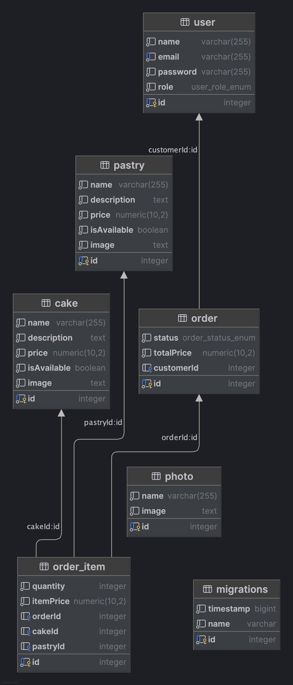

<div align="center" style="margin-bottom: 28px;">
  
  <h1 style="margin: 0; display: inline-block; vertical-align: middle;">Веб-приложение для индивидуального кондитера и его пекарни </h1>
</div>

Bakery Web — это клиент-серверное веб-приложение, разработанное для управления каталогом тортов и пирожных.

Ссылка: https://bakery-web-my-repo.onrender.com/

## Основные возможности

- 🧁 Просмотр каталога тортов и пирожных с пагинацией;
- 🥨 Интерфейс для поиска тортов по названию;
- 🍰 Интерфейс для  создания, редактирование и удаление товаров;
- 🍧 REST API ([swagger](https://bakery-web-my-repo.onrender.com/api/docs))
- 🍩 GraphQL ([playground](https://bakery-web-my-repo.onrender.com/graphql))
- 🥨 Загрузка файлов при создании item
- 🥐 Кеширование с помощью заголовка Cache-Control
- 🍦 Измерение время обработки запроса
- 🍭 Уведомление об изменении данных в режиме реального времени с использованием Server-Sent Events (SSE)
- 🥞 Добавлен механизм работы с миграциями и загрузкой тестовых данных

## Технологии

- NestJS
- TypeScript
- TypeORM
- PostgreSQL

## Хранение данных

Хостинг сервиса: https://render.com

Хостинг базы даных: https://aiven.io

Хостинг для картинок: https://iimg.su

S3 хранилище: https://yandex.cloud/

## Инструкция для локального запуска:

```bash
npm install; npm run build

# Запуск миграций
npm run migration:run; 

# Заполнение тестовыми данными
npm run seed:run
```

## Структура базы данных

<div align="center">
  
</div>

1.User (Пользователь)

Описание: Учетные записи пользователей системы
Атрибуты:

id : Уникальный идентификатор
email : Email (уникальный, для входа)
password : пароль
name :  имя
role : Роль (customer, admin)

orders : One-to-Many → Order (история заказов)

Бизнес-правила:
Email должен быть уникальным

2.Cake (Торт)

Описание: Торты как основной продукт
Атрибуты:

id : Уникальный идентификатор
name : Название (например, "Красный бархат")
description : Описание состава и декора
price : Базовая цена за 1 кг
isAvailable: Доступность

orderItems : One-to-Many → OrderItem

3. Pastry (Пирожное)

Описание: Штучные кондитерские изделия
Атрибуты:

id : Уникальный идентификатор
name : Название (например, "Эклер")
pricePerPiece : Цена за 1 шт.
minOrderQuantity : Минимальное количество (например, 6)
isAvailable: Доступность

orderItems : One-to-Many → OrderItem

4. OrderItem (Позиция заказа)

Описание: Элемент в составе заказа
Атрибуты:

id : Уникальный идентификатор
quantity : Количество элемента
itemPrice : Цена заказа

Отношения:
order : Many-to-One → Order
cake : Many-to-One → Cake
pastry : Many-to-One → Pastry

Бизнес-правила:
Обязательна ссылка либо на Cake, либо на Pastry

5. Order (Заказ)

Описание: Заказ клиента
Атрибуты:

id : Уникальный идентификатор
status : Статус (new, baking, delivering, completed)
totalPrice : Итоговая сумма


Отношения:
customer : Many-to-One → User
items : One-to-Many → OrderItem

6. Enum OrderStatus 
   NEW - только создан
   IN_PROGRESS - в процессе
   COMPLETED -готов
   CANCELED - отменен

7. Enum Role 
   CUSTOMER - покупатель
   ADMIN - aдмин


